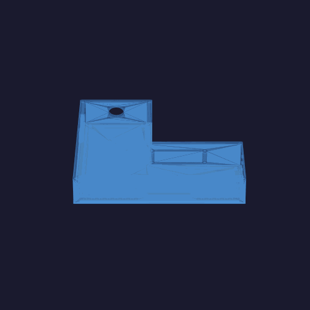

# Telemetry Enclosure



3D-printable enclosure for an airborne / ground-station telemetry stack:

| Component | Notes |
|-----------|-------|
| Raspberry Pi 4B | Bottom layer, M2.5 standoffs |
| RFD900A telemetry radio | Adhesive-mounted to left interior wall |
| Quectel EG25-G LTE module | 4× M3 wall-boss screws via Mini PCIe-to-USB adapter |
| Adafruit DS3231 RTC | Sits directly on Pi GPIO pins (no separate mount) |

| Version | Dimensions (L × W × H) | Role |
|---------|------------------------|------|
| **car-2** (active) | 228.6 × 223.5 × 57.2 mm | Working redesign — edit these exports |
| **car-1.5** (archive) | 228.6 × 223.5 × 57.2 mm | Pristine recovered SolidWorks 2023 STEP baseline |

Printable in PLA or PETG. See [`exports/README.md`](exports/README.md) for file layout.

---

## Repository layout

```
README.md                        ← you are here
telem-enclosure-components.pdf   ← component datasheets / spec reference
cad/
  import_legacy.py        ← import car-1.5 STEP → exports/car-1.5/
  analyze_step.py         ← inspect bounding boxes and hole sizes
  render_gif.py           ← turntable GIF (arg: car-1.5 or car-2)
  face_templates.py       ← 1:1 print templates (legacy compact layout)
  enclosure.py / params.py  ← experimental compact parametric model (not current car-2)
  README.md               ← design notes and print settings
exports/
  README.md               ← version layout guide
  car-1.5/                ← recovered SolidWorks archive (do not edit)
  car-2/                  ← active working folder (legacy-based redesign)
tools/
  freecad-mcp/          ← contextform/freecad-mcp bridge for Cursor MCP
  render-venv/          ← gitignored Python venv for render_gif.py
  FreeCAD.AppImage      ← gitignored (download separately, see below)
  squashfs-root/        ← gitignored (extracted AppImage runtime)
.cursor/
  mcp.json              ← FreeCAD MCP server config for Cursor
```

## Quick start

1. **Get FreeCAD 1.0+** — either via apt or AppImage:
   ```bash
   sudo apt install freecad          # Ubuntu / Debian
   # or download the AppImage from https://freecad.org/downloads.php
   # and place it at tools/FreeCAD.AppImage
   ```

2. **Regenerate the car-1.5 archive** (only if source STEP files changed):
   ```bash
   echo 'exec(open("cad/import_legacy.py").read())' | \
     ./tools/squashfs-root/usr/bin/freecadcmd
   ```
   Reads `exports/car-1.5/SoftwareEnclosure*Car1.5.STEP`, aligns the body to
   origin, and writes `enclosure_body.{FCStd,step,stl}`, `enclosure_lid.*`, and
   `telem_enclosure_assembly.FCStd` into `exports/car-1.5/`.

3. **Work in `exports/car-2/`** — the active redesign. Copy fresh exports from
   `car-1.5/` when resetting, then edit `enclosure_body.{FCStd,step,stl}` (and lid
   as needed) in FreeCAD GUI or via the MCP bridge below.

4. **Regenerate the README preview GIF** after car-2 changes:
   ```bash
   tools/render-venv/bin/python cad/render_gif.py car-2
   ```

See [`cad/README.md`](cad/README.md) for design notes and print settings.

## Cursor MCP (drive FreeCAD from chat)

The repo ships a `.cursor/mcp.json` pointing to the bundled `freecad-mcp` bridge.

1. Install the Python `mcp` package (already done if you cloned this repo with the venv):
   ```bash
   cd tools/freecad-mcp && python3 -m venv .venv && .venv/bin/pip install mcp
   ```
2. In Cursor: **Settings → MCP → reload** — a `freecad` server should appear.
3. Launch FreeCAD GUI, open `exports/car-2/enclosure_body.FCStd` or `enclosure_lid.FCStd`,
   then ask the agent to make changes; it drives FreeCAD live over the Unix socket.

## Printing

| | Body | Lid |
|---|---|---|
| Material | PETG (preferred) or PLA | PETG or PLA |
| Layer height | 0.2 mm | 0.2 mm |
| Infill | 20% gyroid | 20% gyroid |
| Walls | 3 perimeters | 3 perimeters |
| Supports | Tree — I/O cutouts only | None |
| Orientation | Open side up | Top face down |

Use M2.5 brass heat-set inserts in the Pi standoffs and lid-corner screw bosses  
for reusability. M3 × 6 mm self-tappers secure the Quectel adapter to its posts.
